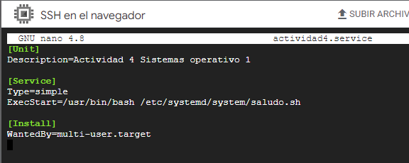
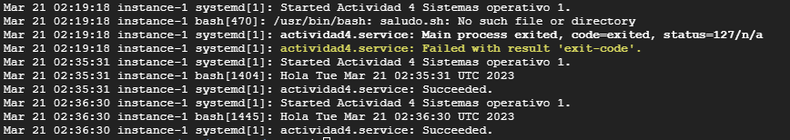

# Creacion de systemd unit
Se crea el archivo que contiene la configuracion del servicio, en este caso se creo el archivo llamado: actividad4.service
```
nano actividad4.service
```

Posteriormente se procede escribir la configuracion del servicio dentro del archivo creado:

En donde:
- ExecStart indica la ruta del archivo del script con el saludo a ejecutar
- Type indice que es simple, y por lo tanto el proceso se ejecuta en primer plano.
-Descripcion indica la descripción del servicio

- Se ejecuta el comando para recargar todos los archivos unitarios y recrear el árbol de dependencias
```
systemctl daemon-reload
```

- Se ejecuta el siguiente comando para iniciar el servicio
```
systemctl start actividad4.service
```

- Y por útlimo se ejecuta el siguiente comando para ver la salida del servicio
```
sudo journalctl -u actividad4
```

Obteniendo como resultado la siguiente salida
